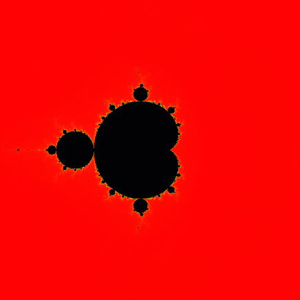

# Set Simulator

This simulation uses Numpy to generate a 2D array of pixels mapped to points on the complex plane. These complex points are converted to RGB values where the color of each pixel states how far that complex number is in the recursive process of the selected set.

## Mandelbrot Set Recursive Definition
The Mandelbrot Set is defined as the set of all complex numbers that converge as the number of recursions (n) approach infinity.


It has been proven that if the absolute value of some complex number C is greater than 2 at any point in the recursive process, that complex number is divergent and not in the set. We use that very convenient fact in the program.

## Visual Example


Notice how the color changes as we zoom into the set. Every black pixel is a complex number that is in the set, while every other pixel is colored somewhere farther on the color spectrum based on how many iterations it took before that complex number (pixel) began to diverge. 

Complex numbers colored orange took longer to diverge than complex numbers colored red, yellow longer than orange, green longer than yellow, etc, until the end of the spectrum (maximum recursions). This depends entirely on the color map selected in the GUI. The set simulator has since been updated to handle many different colormaps included by matplotlib.

At the moment the set simulator only handles the Mandelbrot set, with plans to include the Julia set(s) in the near future, and possibly even other complex iterative sets.

## Usage

To run the simulation,
```python
python main.py
```
To build a single file executable,
```python
python build.py
```

Left-click to zoom in and right-click to zoom out. The more delay (MS) set within the GUI, the more lag introduced between each frame of animation. Lowering the delay nets a more smooth animation with higher tendency to lockup the GUI, so set the delay according to system specifications. Higher delay is recommended with higher resolution simulations. Have fun!

## License
[GNU GPLv3](https://choosealicense.com/licenses/agpl-3.0/)